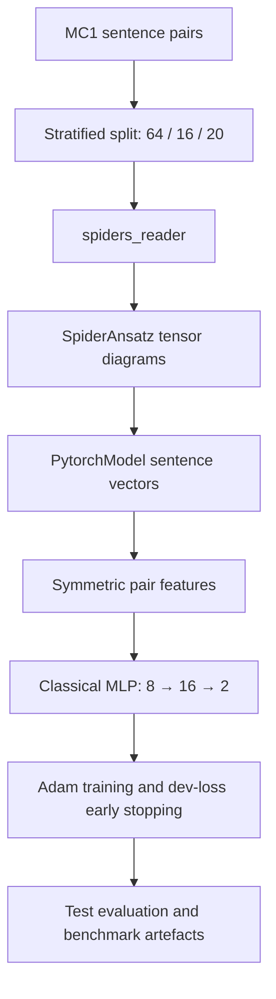
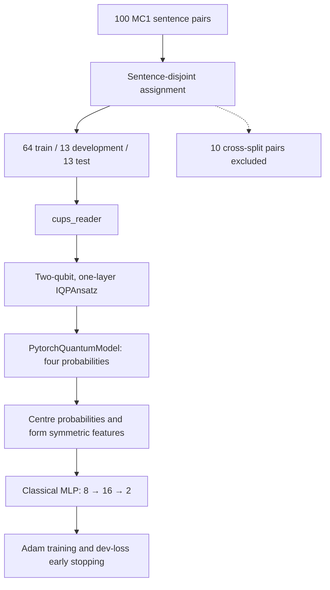

# Accelerating hybrid quantum-classical ML on HPC

Topic-aware QNLP sentence classifier (programming vs cooking), accelerated from a
>1hr/6-word-sentence CPU prototype toward GPU-based quantum simulation on HPC.

## Project status

| Component | Current status |
|---|---|
| MC1 data preparation and validation | Implemented |
| SpiderAnsatz tensor baseline | Implemented with config-driven and direct entrypoints |
| IQPAnsatz quantum-classical CPU reference | Implemented with sentence-disjoint evaluation |
| Backend capability probing and forward/backward verification | Implemented |
| GPU simulator configurations | Registered as HPC targets; verification depends on the target node |
| Repeated CPU-versus-GPU benchmark results | Not yet reported in the repository |

The current IQP experiment is a CPU tensor-contraction reference implementation.
Registered Aer, PennyLane, and GPU configurations are backend targets and must be
verified on the machine where they will run; their presence in the registry is not
itself a benchmark result.

## Team Roles

* **Saif Ibna Ezhar Arko — Software Development Lead:** Dependency management, backend integration, CI/CD, data pipeline.

* **Evelyn (Yueying) Wu** — **Quantum Machine Learning Researcher & CPU Baseline Developer:** QNLP methodology; SpiderAnsatz model development; implementation of a `cups_reader`–`IQPAnsatz` sentence-pair hybrid QNN with a classical MLP head using lambeq’s `PytorchQuantumModel`; MC1 experiment and sentence-disjoint evaluation design; and development of the modular CPU reference pipeline for training, evaluation, benchmarking, testing, and reproducibility. This CPU pipeline serves as the reference architecture and correctness baseline for the team’s GPU backend implementations and performance comparisons.


## Docs

* Repository layout and implementation notes are documented in
  [`PROJECT_STRUCTURE.md`](PROJECT_STRUCTURE.md).

## Quick start

### Requirements

* Git;
* Python `>=3.11,<3.12`;
* [Poetry](https://python-poetry.org/).

```bash
git clone https://github.com/saifibnaezhararko/Accelerating-hybrid-quantum-classical-machine-learning-tasks-on-HPC-platforms.git
cd Accelerating-hybrid-quantum-classical-machine-learning-tasks-on-HPC-platforms
```

```bash
poetry install --with dev          # CPU baseline + tooling (includes torch)
poetry run pytest                  # test suite
poetry run pre-commit install      # enable git hooks
```

On the HPC node (CUDA 12.4–12.6, NVIDIA driver 550+):

```bash
poetry install --with dev,quantum,gpu  # circuit backends + GPU packages
```

## Data pipeline

### Tracked MC1 dataset

The tracked [`data/processed/MC1.txt`](data/processed/MC1.txt) contains 100
sentence pairs built from 83 unique sentences. It has 47 label-`0` pairs and 53
label-`1` pairs. Each non-empty line has the form

```text
sentence 1, sentence 2, label
```

The repository does not currently document the original provenance or
redistribution terms of `MC1.txt`. The dataset source and licence should be
confirmed by the project team before a formal release or publication.

One funnel for every dataset: acquire → convert → validate → `data/processed/`.

```bash
# validate what is already tracked
poetry run python scripts/prepare_data.py --input data/processed/MC1.txt --check-only

# convert any CSV/TSV/JSON/JSONL into the MC1 format the trainer reads
poetry run python scripts/prepare_data.py \
    --input data/raw/pairs.csv \
    --sentence-1-col first --sentence-2-col second --label-col same_topic \
    --label-map same=1 --label-map other=0 \
    --output data/processed/pairs_v2.txt

# pull from Kaggle first (needs `poetry install --with data` + credentials)
poetry run python scripts/prepare_data.py --kaggle owner/dataset --input-name pairs.csv \
    --output data/processed/pairs_v2.txt
```

Validation rejects the failure modes this format actually has: a comma inside a
sentence (it would shift the delimiter and eat the label), a label outside `{0, 1}`,
a class with too few members to stratify, and exact duplicate pairs (they leak
across the train/test split). `--summary-json` writes the record count, label
balance, and sentence-length range for the experiment log.

## MC1 model pipelines

The repository provides two modular reference pipelines for the MC1 binary
sentence-pair classification task:

* label `0`: the two sentences belong to different domains;
* label `1`: the two sentences belong to the same domain.

Both pipelines use a symmetric Siamese architecture: the two sentences are
processed by the same model, and their representations are combined as

`pair_features = [|z₁ - z₂|, z₁ ⊙ z₂]`.

The resulting prediction is invariant under exchanging the order of the two
sentences. The pipelines differ in their sentence representation, evaluation
split, and execution backend.

| Component               | SpiderAnsatz tensor baseline                                     | IQPAnsatz quantum-classical baseline                                                        |
| ----------------------- | ---------------------------------------------------------------- | ------------------------------------------------------------------------------------------- |
| Data split              | Stratified pair-level split: 64 train / 16 development / 20 test | Sentence-disjoint split: 64 train / 13 development / 13 test; 10 cross-split pairs excluded |
| Reader                  | `spiders_reader`                                                 | `cups_reader`                                                                               |
| Ansatz                  | `SpiderAnsatz`                                                   | Two-qubit, one-layer `IQPAnsatz`                                                            |
| lambeq model            | `PytorchModel`                                                   | `PytorchQuantumModel`                                                                       |
| Sentence representation | Four-dimensional tensor-derived vector                           | Four circuit-output probabilities, centred to `[-1, 1]`                                     |
| Pair representation     | Absolute difference and elementwise product                      | Absolute difference and elementwise product                                                 |
| Classifier              | `Linear(8,16) → GELU → Linear(16,2)`                             | `Linear(8,16) → GELU → Dropout(0.05) → Linear(16,2)`                                        |
| Model selection         | Minimum development loss                                         | Minimum development loss                                                                    |
| Current execution       | PyTorch tensor contraction; CUDA is used when available          | CPU tensor-contraction reference implementation                                             |
| Primary purpose         | Classical tensor-network baseline                                | Correctness baseline for circuit-backend and GPU implementations                            |

### SpiderAnsatz tensor pipeline

The SpiderAnsatz experiment is a classical tensor-network QNLP baseline. It
uses a reproducible stratified pair-level split with seed `2`.



`SpiderAnsatz` uses noun dimension `4`, sentence dimension `4`, and
`max_order=2`. Each sentence diagram is contracted into a four-dimensional
vector. Two sentence vectors are converted into eight symmetric pair features
and passed to the classical MLP classifier.

The default experiment runs for at most 150 epochs with Adam, learning rate
`2e-3`, batch size `8`, and early-stopping patience `20`. The selected
checkpoint is the epoch with the lowest development cross-entropy loss.

### IQPAnsatz quantum-classical pipeline

The IQP experiment replaces the tensor representation with parameterised
quantum circuits while retaining the symmetric classical classifier.

Its deterministic sentence-disjoint split prevents a complete sentence from
appearing in more than one of the training, development, and test sets. Pairs
whose two sentences belong to different splits are excluded and recorded for
diagnostics.



Each sentence is mapped by `cups_reader` to a grammatical diagram and then to
a two-qubit IQP circuit with one IQP layer and three single-qubit parameters.
The circuit produces four output probabilities. Before pair construction, each
component is centred using

`z = 2 × (p - 0.5)`.

The model then forms `|z₁ - z₂|` and `z₁ ⊙ z₂`, concatenates them into eight
features, and sends them through the classical MLP head.

The default experiment runs for at most 120 epochs with Adam, learning rate
`1e-3`, batch size `8`, dropout `0.05`, and early-stopping patience `20`.
Only training circuits define the model's trainable symbol table; the pipeline
checks that the held-out circuits introduce no unseen trainable symbols.

> **Backend status:** although this pipeline constructs IQP quantum circuits,
> the merged implementation currently evaluates them through lambeq's
> `PytorchQuantumModel` tensor contraction on CPU. It therefore serves as the
> reference architecture and correctness baseline for subsequent Qiskit Aer,
> PennyLane, and GPU simulator implementations; it is not yet an Aer-GPU
> benchmark itself.

## Running the MC1 experiments

### SpiderAnsatz baseline

```bash
# Recommended config-driven run
poetry run python scripts/run_experiment.py \
    --config configs/mc1_spider.yaml

# Fast three-epoch end-to-end check; not a benchmark result
poetry run python scripts/run_experiment.py \
    --config configs/mc1_spider_smoke.yaml

# Direct entrypoint using the constants in mc1_spider/config.py
poetry run python scripts/train_mc1_spider.py
```

`configs/mc1_spider.yaml` reproduces the defaults in
`src/qnlp_hpc/mc1_spider/config.py`. A test fails if the two configurations
drift apart.

### IQPAnsatz baseline

```bash
poetry run python scripts/train_mc1_iqp_cups.py
```

The IQP configuration, including its fixed sentence assignments, is defined in
`src/qnlp_hpc/mc1_iqp_cups/config.py`.

## Experiment outputs

Generated artefacts are written to `outputs/mc1_spider/` or
`outputs/mc1_iqp_cups/` and are excluded from version control.

Both pipelines export:

* training and development loss/accuracy histories;
* four benchmark plots;
* the checkpoint selected by minimum development loss;
* serialized lambeq and PyTorch model states;
* test predictions and class probabilities;
* a run summary containing the configuration, runtime, and evaluation metrics.

The IQP pipeline additionally exports the sentence-to-split manifest, split
statistics, and the cross-split pairs excluded from evaluation.

> **Evaluation note:** raw SpiderAnsatz and IQPAnsatz test accuracies are not
> directly comparable because the Spider pipeline uses a pair-level stratified
> split, whereas the IQP pipeline uses the stricter sentence-disjoint split.
> Accuracy comparisons should use a common split protocol; runtime and backend
> benchmarks should also report the simulator and hardware configuration.

## Backends

Backend availability is machine-dependent. The registry describes target
configurations; `--verify` provides the runtime evidence that a configuration can
execute and, where applicable, propagate gradients on the current machine. GPU
backends are not exercised by the CPU-only GitHub Actions workflow.

```bash
poetry run python scripts/check_backends.py            # what this machine can run
poetry run python scripts/check_backends.py --verify   # prove it: real forward/backward
poetry run python scripts/check_backends.py --require-gpu --json outputs/backends.json
```

`--verify` builds real circuits and pushes a forward — and, where the backend is
differentiable, a backward — pass through each available backend. That is the
difference between "qiskit-aer is installed" and "the PyTorch↔Qiskit seam works on
this node", and it is what to run after every simulator install on HPC.
`--require-gpu` exits non-zero when no GPU simulator is usable, so it can gate a job
script.

| Backend | Kind | Trainer | Notes |
|---------|------|---------|-------|
| `pytorch-tensor` | tensor | PyTorch | SpiderAnsatz tensor baseline; CUDA when torch reports it |
| `numpy` | circuit | Quantum | Exact statevector — the reference for the Aer paths |
| `pennylane-default` / `-lightning` | circuit | PyTorch | CPU circuit simulation, torch autograd |
| `pennylane-lightning-gpu` | circuit | PyTorch | Target cuStateVec/cuQuantum configuration; verify on the HPC node |
| `pennylane-qiskit-aer` / `-gpu` | circuit | PyTorch | Qiskit Aer through PennyLane; verify the selected CPU/GPU device locally |
| `tket-aer` | circuit | Quantum | The original prototype path, shot-based + SPSA |

Circuit backends need `poetry install --with quantum`; the GPU ones additionally
need `--with gpu` (or `pennylane-lightning[gpu]`) on a CUDA node.

## Benchmark sweeps

The current sweep entrypoint is wired to the config-driven SpiderAnsatz
experiment. The direct IQP entrypoint is not yet integrated into this sweep
runner.

```bash
poetry run python scripts/run_sweep.py --seeds 0-29                      # 30 repetitions
poetry run python scripts/run_sweep.py --seeds 0-4 --grid sentence_dim=2,4,8
poetry run python scripts/run_sweep.py --seeds 0-29 --jobs 4 --quiet
poetry run python scripts/run_sweep.py --seeds 0-29 --dry-run            # plan only
```

Each repetition runs as its own subprocess into `outputs/sweeps/<sweep>/<run-id>/`,
then the sweep collects every run summary into `sweep_runs.csv` and aggregates
`sweep_summary.csv` with mean, std and a 95% confidence interval (Student's *t*).
A fresh process per run costs a few seconds of import overhead — the price of the
pipeline's import-time constants — but it isolates crashes, so one bad seed cannot
take the sweep down.

`tests/Zijia_spider_test.py` is the earlier standalone baseline, kept verbatim as
contributed. It is excluded from pytest collection, lint, and formatting — run it
by hand from `tests/` if you want the original numbers.

## Limitations

* MC1 contains only 100 sentence pairs and represents a small two-domain
  classification task.
* The SpiderAnsatz and IQPAnsatz pipelines currently use different split
  protocols, so their test accuracies are not directly comparable.
* The merged IQP pipeline uses exact CPU tensor contraction through
  `PytorchQuantumModel`; it does not yet report Aer-GPU, shot-based, or quantum
  hardware results.
* GPU backends are target configurations that require verification and
  benchmarking on the actual HPC node.
* No repeated CPU-versus-GPU performance table is currently committed, and the
  repository makes no quantum-advantage claim.
* The repository does not currently track `poetry.lock`, so exact dependency
  resolutions can vary between installations.

## Contributing

Before opening a pull request, install the development dependencies and run the
local checks:

```bash
poetry install --with dev
poetry run pre-commit run --all-files
poetry run pytest
```

Backend changes should also be checked with:

```bash
poetry run python scripts/check_backends.py --verify
```

GPU-related claims should include the simulator version, CPU/GPU model, CUDA
version, differentiation method, precision, dataset split, repetitions, and wall
time measured on the target HPC node.

## License

The package metadata in [`pyproject.toml`](pyproject.toml) declares the MIT
licence, but the repository does not currently contain a `LICENSE` file. The
maintainers should add the agreed licence file before formal redistribution.

## Stack

Python 3.11 · lambeq 0.5.0 · Qiskit 2.x · Qiskit Aer (CPU) / Aer-GPU + cuQuantum (HPC) · pytket.
See [`pyproject.toml`](pyproject.toml) for the exact dependency constraints and
optional dependency groups.
