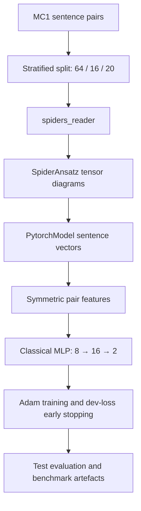
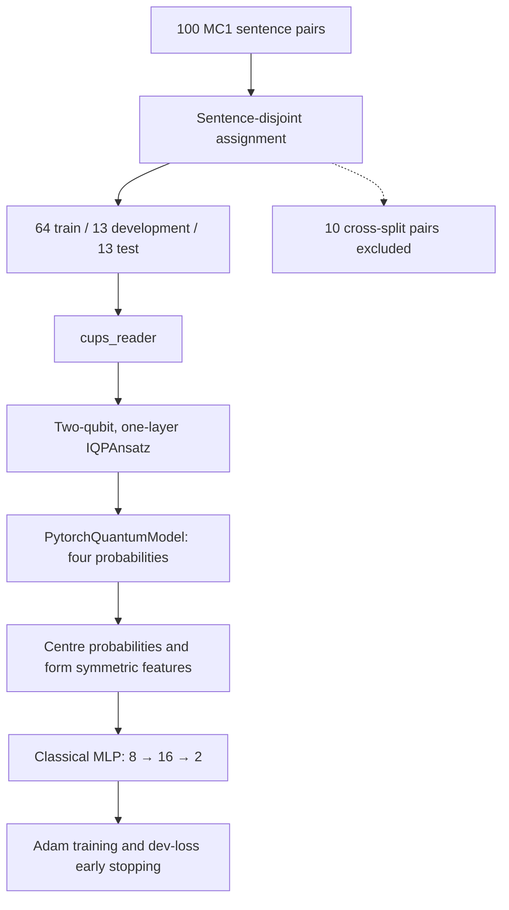

# Accelerating hybrid quantum-classical ML on HPC

Topic-aware QNLP sentence classifier (programming vs cooking), accelerated from a
>1hr/6-word-sentence CPU prototype toward GPU-based quantum simulation on HPC.

## Team Roles

* **Saif Ibna Ezhar Arko** — **Software Development Lead & Quantum Backend Integration Developer**
  * **Infrastructure and version maintenance** — repository structure, Poetry dependency groups (CPU/GPU/quantum/data), pre-commit, two-job GitHub Actions CI, dependency-resolution fixes for a clean-checkout install and green CI.
  * **Testing** — compatibility and reliability tests in [`tests/`](tests/): baseline-configuration consistency, data-schema validation, backend requirement resolution, statistical aggregation.
  * **Data and experiment automation** — data pipeline (`acquire → convert → validate`), configuration layer (`configs/*.yaml`), multi-seed sweep runner with 95% confidence-interval aggregation.
  * **Backend layer** — [`src/qnlp_hpc/backends/`](src/qnlp_hpc/backends/) and `scripts/check_backends.py`: probe the host, register eight simulator configurations, verify each with a real forward and backward pass, for HPC job gating.
  * **CNN–VQC hybrid pipeline** (final presentation pipeline 3) — TREC reduction script `scripts/prepare_trec.py`, NISQ-scale [`modified_trec_dataset/`](modified_trec_dataset/) (174/44 train/test, balanced DESC vs HUM, ≤8 words, zero OOV), and the `TextCNN → 4-qubit variational circuit → linear head` model in [`pennylane_aer/`](pennylane_aer/), trained end-to-end on Aer: **0.9773 test accuracy against a 0.9545 classical CNN control** (HPC GPU run, single seed).
  * **PennyLane–Qiskit Aer integration** — validated port of the CPU IQP model onto Aer (identical predictions to float32 epsilon); two silent failure modes (default Aer is not analytic; post-selected circuits return NaN under shots); GPU-capable device configuration; classical controls and runtime baselines.

* **Evelyn (Yueying) Wu** — **Quantum Machine Learning Researcher & CPU Baseline Developer:** QNLP methodology; SpiderAnsatz model development; implementation of a `cups_reader`–`IQPAnsatz` sentence-pair hybrid QNN with a classical MLP head using lambeq’s `PytorchQuantumModel`; MC1 experiment and sentence-disjoint evaluation design; and development of the modular CPU reference pipeline for training, evaluation, benchmarking, testing, and reproducibility. This CPU pipeline serves as the reference architecture and correctness baseline for the team’s GPU backend implementations and performance comparisons.


## Docs

* repository layout in [`PROJECT_STRUCTURE.md`](PROJECT_STRUCTURE.md); experiment notes in [`pennylane_aer/README.md`](pennylane_aer/README.md).

## Quick start

```bash
poetry install --with dev          # CPU baseline + tooling (includes torch)
poetry run pytest                  # test suite
poetry run pre-commit install      # enable git hooks
```

On the HPC node (CUDA 12.4–12.6, NVIDIA driver 550+):

```bash
poetry install --with dev,gpu      # add qiskit-aer-gpu + cuQuantum
```

## Data pipeline

One funnel for every dataset: acquire → convert → validate → `data/processed/`.

```bash
# validate what is already tracked
poetry run python scripts/prepare_data.py --input data/processed/MC1.txt --check-only

# convert any CSV/TSV/JSON/JSONL into the MC1 format the trainer reads
poetry run python scripts/prepare_data.py \
    --input data/raw/pairs.csv \
    --sentence-1-col first --sentence-2-col second --label-col same_topic \
    --label-map same=1 --label-map other=0 \
    --output data/processed/pairs_v2.txt

# pull from Kaggle first (needs `poetry install --with data` + credentials)
poetry run python scripts/prepare_data.py --kaggle owner/dataset --input-name pairs.csv \
    --output data/processed/pairs_v2.txt
```

Validation rejects the failure modes this format actually has: a comma inside a
sentence (it would shift the delimiter and eat the label), a label outside `{0, 1}`,
a class with too few members to stratify, and exact duplicate pairs (they leak
across the train/test split). `--summary-json` writes the record count, label
balance, and sentence-length range for the experiment log.

## MC1 model pipelines

The repository provides two modular reference pipelines for the MC1 binary
sentence-pair classification task:

* label `0`: the two sentences belong to different domains;
* label `1`: the two sentences belong to the same domain.

Both pipelines use a symmetric Siamese architecture: the two sentences are
processed by the same model, and their representations are combined as

`pair_features = [|z₁ - z₂|, z₁ ⊙ z₂]`.

The resulting prediction is invariant under exchanging the order of the two
sentences. The pipelines differ in their sentence representation, evaluation
split, and execution backend.

| Component               | SpiderAnsatz tensor baseline                                     | IQPAnsatz quantum-classical baseline                                                        |
| ----------------------- | ---------------------------------------------------------------- | ------------------------------------------------------------------------------------------- |
| Data split              | Stratified pair-level split: 64 train / 16 development / 20 test | Sentence-disjoint split: 64 train / 13 development / 13 test; 10 cross-split pairs excluded |
| Reader                  | `spiders_reader`                                                 | `cups_reader`                                                                               |
| Ansatz                  | `SpiderAnsatz`                                                   | Two-qubit, one-layer `IQPAnsatz`                                                            |
| lambeq model            | `PytorchModel`                                                   | `PytorchQuantumModel`                                                                       |
| Sentence representation | Four-dimensional tensor-derived vector                           | Four circuit-output probabilities, centred to `[-1, 1]`                                     |
| Pair representation     | Absolute difference and elementwise product                      | Absolute difference and elementwise product                                                 |
| Classifier              | `Linear(8,16) → GELU → Linear(16,2)`                             | `Linear(8,16) → GELU → Dropout(0.05) → Linear(16,2)`                                        |
| Model selection         | Minimum development loss                                         | Minimum development loss                                                                    |
| Current execution       | PyTorch tensor contraction; CUDA is used when available          | CPU tensor-contraction reference implementation                                             |
| Primary purpose         | Classical tensor-network baseline                                | Correctness baseline for circuit-backend and GPU implementations                            |

### SpiderAnsatz tensor pipeline

The SpiderAnsatz experiment is a classical tensor-network QNLP baseline. It
uses a reproducible stratified pair-level split with seed `2`.



`SpiderAnsatz` uses noun dimension `4`, sentence dimension `4`, and
`max_order=2`. Each sentence diagram is contracted into a four-dimensional
vector. Two sentence vectors are converted into eight symmetric pair features
and passed to the classical MLP classifier.

The default experiment runs for at most 150 epochs with Adam, learning rate
`2e-3`, batch size `8`, and early-stopping patience `20`. The selected
checkpoint is the epoch with the lowest development cross-entropy loss.

### IQPAnsatz quantum-classical pipeline

The IQP experiment replaces the tensor representation with parameterised
quantum circuits while retaining the symmetric classical classifier.

Its deterministic sentence-disjoint split prevents a complete sentence from
appearing in more than one of the training, development, and test sets. Pairs
whose two sentences belong to different splits are excluded and recorded for
diagnostics.



Each sentence is mapped by `cups_reader` to a grammatical diagram and then to
a two-qubit IQP circuit with one IQP layer and three single-qubit parameters.
The circuit produces four output probabilities. Before pair construction, each
component is centred using

`z = 2 × (p - 0.5)`.

The model then forms `|z₁ - z₂|` and `z₁ ⊙ z₂`, concatenates them into eight
features, and sends them through the classical MLP head.

The default experiment runs for at most 120 epochs with Adam, learning rate
`1e-3`, batch size `8`, dropout `0.05`, and early-stopping patience `20`.
Only training circuits define the model's trainable symbol table; the pipeline
checks that the held-out circuits introduce no unseen trainable symbols.

> **Backend status:** although this pipeline constructs IQP quantum circuits,
> the merged implementation currently evaluates them through lambeq's
> `PytorchQuantumModel` tensor contraction on CPU. It therefore serves as the
> reference architecture and correctness baseline for subsequent Qiskit Aer,
> PennyLane, and GPU simulator implementations; it is not yet an Aer-GPU
> benchmark itself.

## Running the MC1 experiments

### SpiderAnsatz baseline

```bash
# Recommended config-driven run
poetry run python scripts/run_experiment.py \
    --config configs/mc1_spider.yaml

# Fast three-epoch end-to-end check; not a benchmark result
poetry run python scripts/run_experiment.py \
    --config configs/mc1_spider_smoke.yaml

# Direct entrypoint using the constants in mc1_spider/config.py
poetry run python scripts/train_mc1_spider.py
```

`configs/mc1_spider.yaml` reproduces the defaults in
`src/qnlp_hpc/mc1_spider/config.py`. A test fails if the two configurations
drift apart.

### IQPAnsatz baseline

```bash
poetry run python scripts/train_mc1_iqp_cups.py
```

The IQP configuration, including its fixed sentence assignments, is defined in
`src/qnlp_hpc/mc1_iqp_cups/config.py`.

## Experiment outputs

Generated artefacts are written to `outputs/mc1_spider/` or
`outputs/mc1_iqp_cups/` and are excluded from version control.

Both pipelines export:

* training and development loss/accuracy histories;
* four benchmark plots;
* the checkpoint selected by minimum development loss;
* serialized lambeq and PyTorch model states;
* test predictions and class probabilities;
* a run summary containing the configuration, runtime, and evaluation metrics.

The IQP pipeline additionally exports the sentence-to-split manifest, split
statistics, and the cross-split pairs excluded from evaluation.

> **Evaluation note:** raw SpiderAnsatz and IQPAnsatz test accuracies are not
> directly comparable because the Spider pipeline uses a pair-level stratified
> split, whereas the IQP pipeline uses the stricter sentence-disjoint split.
> Accuracy comparisons should use a common split protocol; runtime and backend
> benchmarks should also report the simulator and hardware configuration.

## Backends

```bash
poetry run python scripts/check_backends.py            # what this machine can run
poetry run python scripts/check_backends.py --verify   # prove it: real forward/backward
poetry run python scripts/check_backends.py --require-gpu --json outputs/backends.json
```

`--verify` builds real circuits and pushes a forward — and, where the backend is
differentiable, a backward — pass through each available backend. That is the
difference between "qiskit-aer is installed" and "the PyTorch↔Qiskit seam works on
this node", and it is what to run after every simulator install on HPC.
`--require-gpu` exits non-zero when no GPU simulator is usable, so it can gate a job
script.

| Backend | Kind | Trainer | Notes |
|---------|------|---------|-------|
| `pytorch-tensor` | tensor | PyTorch | SpiderAnsatz tensor baseline; CUDA when torch reports it |
| `numpy` | circuit | Quantum | Exact statevector — the reference for the Aer paths |
| `pennylane-default` / `-lightning` | circuit | PyTorch | CPU circuit simulation, torch autograd |
| `pennylane-lightning-gpu` | circuit | PyTorch | cuStateVec/cuQuantum on the HPC node |
| `pennylane-qiskit-aer` / `-gpu` | circuit | PyTorch | Qiskit Aer through PennyLane — Experiments 1 and 2 |
| `tket-aer` | circuit | Quantum | The original prototype path, shot-based + SPSA |

Circuit backends need `poetry install --with quantum`; the GPU ones additionally
need `--with gpu` (or `pennylane-lightning[gpu]`) on a CUDA node.

## CNN–VQC hybrid on TREC

The MC1 pipelines above tie circuit width to sentence grammar, so a longer
sentence means a wider circuit. The hybrid route decouples the two: a CNN learns
the sentence features, and the circuit width becomes a hyperparameter.

```
tokens → trainable embeddings → Conv1d(2,3,4) + max-pool → tanh·π → 4 angles
       → AngleEmbedding + 2 StronglyEntanglingLayers → 4 ⟨Z⟩ → Linear(4,2)
```

Nothing is post-selected, so unlike the lambeq circuits this model is valid under
shots and on real hardware. The `tanh → π` scaling matters: unbounded activations
would wrap around the Bloch sphere and alias different sentences onto the same
angle.

### Dataset

`scripts/prepare_trec.py` reduces raw TREC (5,452 questions, ~8,700-word
vocabulary, up to 37 words) to a NISQ-scale binary subset in
`modified_trec_dataset/`:

| split | questions | DESC / HUM | vocabulary | words |
|-------|-----------|------------|------------|-------|
| train | 174 | 87 / 87 | 354 | 2–8 |
| test  | 44  | 22 / 22  | 110 | 3–8 |

```bash
python scripts/prepare_trec.py            # regenerate modified_trec_dataset/
```

Filters (all CLI-tunable, seed `0`): lowercase, strip punctuation-only tokens,
≤ 8 words, coarse classes DESC vs HUM, minimum word frequency 2, class-balanced
downsampling. The official TREC split is unusable after filtering — almost no
official test question stays inside the filtered training vocabulary — so the two
files are pooled and re-split 80/20 stratified with a vocabulary-aware draw, which
gives a test set with **zero out-of-vocabulary words by construction**.
`--keep-original-split` preserves the official split.

### Results

```bash
python pennylane_aer/04_train_cnn_hybrid.py            # CPU
python pennylane_aer/04_train_cnn_hybrid.py --gpu      # route the Aer path through
                                                       # Aer's GPU statevector
```

4 qubits × 2 layers, parameter-shift gradients, seed `0`. The classical control is
the same CNN with the circuit replaced by a linear layer — without it, a hybrid
accuracy cannot be separated from "the CNN did all the work".

Development box (CPU only), 30 epochs — `pennylane_aer/outputs/`:

| configuration | final test accuracy | best | cost |
|---|---|---|---|
| classical CNN control | 0.9091 | 0.9545 | 0.11 s/epoch |
| hybrid, `default.qubit` | 0.8636 | 0.9091 | 0.70 s/epoch |
| hybrid, Qiskit Aer | not trained | — | 1368 s/epoch (projected) |

HPC node (Tesla V100S-PCIE-32GB, 32 vCPU, 128 GB RAM, CUDA 12.6, driver 560.x),
20 epochs — reported in the final presentation:

| configuration | final test accuracy | cost |
|---|---|---|
| classical CNN control | 0.9545 | 1.3 s total |
| **hybrid, Qiskit Aer GPU** | **0.9773** | **506 s/epoch · 10,127 s total** |

The Aer CPU row is a projection by design: the script runs real optimiser steps and
extrapolates (`benchmark_backend`) rather than pretending to train, because
1368 s/epoch is not trainable on that machine. That also means the GPU training run
above is not what `--gpu` produces by default — the committed script benchmarks and
projects on GPU exactly as it does on CPU.

Aer on GPU runs **2.70× faster than the measured CPU projection**, which is the
acceleration this project set out to demonstrate — but 506 s/epoch against the
classical control's 1.3 s for the whole run shows the gradient cost still
dominates. Aer has no backprop, so PennyLane falls back to parameter-shift, which
cannot differentiate a broadcasted tape: external simulators must be fed one sample
at a time, paying `2 × n_params` circuit evaluations per sample and losing batch
parallelism. GPU acceleration is real here, but it moves an intractable run into a
slow one rather than into a fast one.

> **Read the accuracy carefully.** One seed and 44 test questions mean a single
> sample is worth 2.27 percentage points, so the +2.28 points over the classical
> CNN is one question wide. Multi-seed runs are needed before it is a claim.

The Aer integration itself has two silent failure modes worth knowing before
reusing it — the default Aer backend is not analytic and quietly samples, and
lambeq's post-selected circuits return NaN rather than an error under shots. Both
are documented with measurements in [`pennylane_aer/README.md`](pennylane_aer/README.md),
along with the validated Aer port of the IQP model and a second dimensionality-reduction
route on six-class TREC.

## Benchmark sweeps

```bash
poetry run python scripts/run_sweep.py --seeds 0-29                      # 30 repetitions
poetry run python scripts/run_sweep.py --seeds 0-4 --grid sentence_dim=2,4,8
poetry run python scripts/run_sweep.py --seeds 0-29 --jobs 4 --quiet
poetry run python scripts/run_sweep.py --seeds 0-29 --dry-run            # plan only
```

Each repetition runs as its own subprocess into `outputs/sweeps/<sweep>/<run-id>/`,
then the sweep collects every run summary into `sweep_runs.csv` and aggregates
`sweep_summary.csv` with mean, std and a 95% confidence interval (Student's *t*).
A fresh process per run costs a few seconds of import overhead — the price of the
pipeline's import-time constants — but it isolates crashes, so one bad seed cannot
take the sweep down.

`tests/Zijia_spider_test.py` is the earlier standalone baseline, kept verbatim as
contributed. It is excluded from pytest collection, lint, and formatting — run it
by hand from `tests/` if you want the original numbers.

## Stack

Python 3.11 · lambeq 0.5.0 · Qiskit 2.x · Qiskit Aer (CPU) / Aer-GPU + cuQuantum (HPC) · pytket.
See [`pyproject.toml`](pyproject.toml) for the full version matrix.
